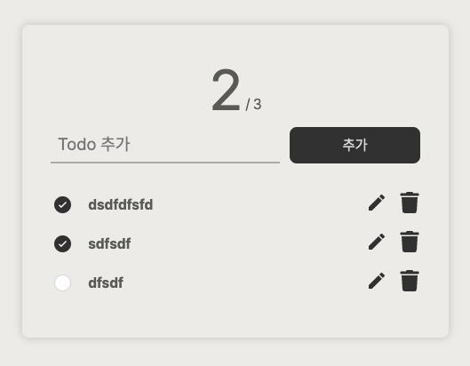
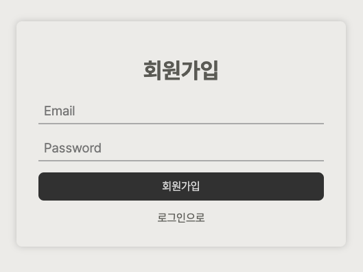

<h1 align="center">프리온보딩 프론트엔드 인턴십</h1>

## 시연 이미지

| `/todo`                     | `/signin`                   | `/signup`                   |
| --------------------------- | --------------------------- | --------------------------- |
|  |  |  |

## 사용한 라이브러리

- react
- @emotion
- axios
- react-icons
- react-router-dom
- typescript
- eslint
- prettier

## 프로젝트 실행

1. 의존성 설치

```
yarn install
```

2. 프로젝트 실행

```
yarn start
```
